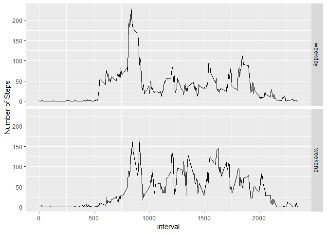

# Reproducible Research: Peer Assessment 1
Tomy Bolanos  
Friday, November 2nd, 2018  

# Load in packages


```r
library(knitr)
library("plyr")
```

```
## Warning: package 'plyr' was built under R version 3.4.4
```

```r
library("ggplot2")
```

```
## Warning: package 'ggplot2' was built under R version 3.4.4
```

```r
opts_chunk$set(echo = TRUE)
```


## Loading and preprocessing the data


```r
data <- read.csv("activity.csv")


data$date = as.Date(x = data$date,format = "%Y-%m-%d")


tail(data)
```

```
##       steps       date interval
## 17563    NA 2012-11-30     2330
## 17564    NA 2012-11-30     2335
## 17565    NA 2012-11-30     2340
## 17566    NA 2012-11-30     2345
## 17567    NA 2012-11-30     2350
## 17568    NA 2012-11-30     2355
```

```r
head(data)
```

```
##   steps       date interval
## 1    NA 2012-10-01        0
## 2    NA 2012-10-01        5
## 3    NA 2012-10-01       10
## 4    NA 2012-10-01       15
## 5    NA 2012-10-01       20
## 6    NA 2012-10-01       25
```

```r
str(data)
```

```
## 'data.frame':	17568 obs. of  3 variables:
##  $ steps   : int  NA NA NA NA NA NA NA NA NA NA ...
##  $ date    : Date, format: "2012-10-01" "2012-10-01" ...
##  $ interval: int  0 5 10 15 20 25 30 35 40 45 ...
```


## Use hist for making the histogram


```r
total_Steps<-aggregate(steps~date,data=data,sum,na.rm=TRUE)
hist(total_Steps$steps,main = "Steps per day", xlab = "Steps", col = "green", breaks = 8)
```

<!-- -->


## What is mean total number of steps taken per day?


```r
meansteps <- mean(total_Steps$steps)
print(sprintf("Mean total steps taken per day: %f", meansteps))
```

```
## [1] "Mean total steps taken per day: 10766.188679"
```

```r
mediansteps <- median(total_Steps$steps)
print(sprintf("Median total steps taken per day: %f", mediansteps))
```

```
## [1] "Median total steps taken per day: 10765.000000"
```


## What is the average daily activity pattern?


```r
avgactivity <- aggregate(steps~interval,data,mean,na.rm = TRUE)
plot(x = avgactivity$interval,y = avgactivity$steps,type = "l",xlab = "5 Min Interval", ylab = "Avg Number of Steps",main = "Avg Daily Activity Planner")
```

<!-- -->

```r
maxSteps = max(avgactivity$steps)
max.avgactivity <- avgactivity$interval[avgactivity$steps == maxSteps]
print(sprintf("5-min time Interval with maximum average steps taken per day: %i",max.avgactivity))
```

```
## [1] "5-min time Interval with maximum average steps taken per day: 835"
```


## Imputing missing values


```r
na_st <- is.na(data$steps)


avg_int <- tapply(data$steps, data$interval, mean, na.rm=TRUE, simplify=TRUE)


data$steps[na_st] <- avg_int[as.character(data$interval[na_st])]
```


## Are there differences in activity patterns between weekdays and weekends?


```r
data$week <- ifelse(weekdays(data$date) == "Saturday" | weekdays(data$date) == "Sunday" ,"weekend","weekday")

#df of the mean and median number of steps taken, averaged across all days (y-axis)
int_steps2 <- aggregate(data$steps, by = list(data$week, data$interval), mean, na.rm=TRUE)
int_stepsmed2 <- aggregate(data$steps, by = list(data$week, data$interval), median, na.rm=TRUE)

int_steps2 <- cbind(int_steps2[], int_stepsmed2$x)

#Tidy the df names and round the numbers
names(int_steps2) = c("weekday", "interval","mean.steps", "median.steps")
int_steps2$mean.steps <- round(int_steps2$mean.steps)
int_steps2$median.steps <- round(int_steps2$median.steps)

ggplot(int_steps2, aes(x = interval, y = mean.steps)) + ylab("Number of Steps") + geom_line() + facet_grid(weekday~.)
```

<!-- -->

