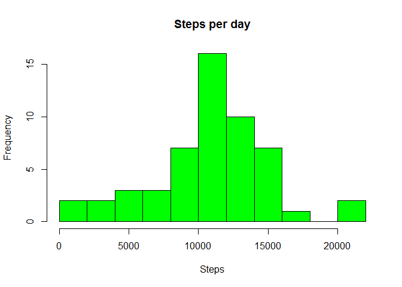
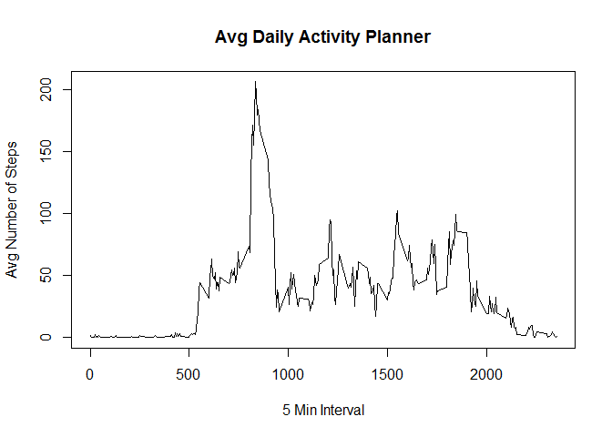
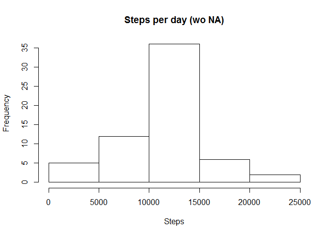

# Reproducible Research: Peer Assessment 1
Tomy Bolanos  
Friday, November 2nd, 2018  

### Load in packages


```r
library(knitr)
library("plyr")
```

```
## Warning: package 'plyr' was built under R version 3.4.4
```

```r
library("ggplot2")
```

```
## Warning: package 'ggplot2' was built under R version 3.4.4
```

```r
opts_chunk$set(echo = TRUE)
```


##Load the data
Process/transform the data (if necessary) into a format suitable for your analysis
change date format


```r
data <- read.csv("activity.csv")


data$date = as.Date(x = data$date,format = "%Y-%m-%d")


tail(data)
```

```
##       steps       date interval
## 17563    NA 2012-11-30     2330
## 17564    NA 2012-11-30     2335
## 17565    NA 2012-11-30     2340
## 17566    NA 2012-11-30     2345
## 17567    NA 2012-11-30     2350
## 17568    NA 2012-11-30     2355
```

```r
head(data)
```

```
##   steps       date interval
## 1    NA 2012-10-01        0
## 2    NA 2012-10-01        5
## 3    NA 2012-10-01       10
## 4    NA 2012-10-01       15
## 5    NA 2012-10-01       20
## 6    NA 2012-10-01       25
```

```r
str(data)
```

```
## 'data.frame':	17568 obs. of  3 variables:
##  $ steps   : int  NA NA NA NA NA NA NA NA NA NA ...
##  $ date    : Date, format: "2012-10-01" "2012-10-01" ...
##  $ interval: int  0 5 10 15 20 25 30 35 40 45 ...
```


###Total number of steps per day###  

1 - Calculate the total number of steps taken per day
2 -  If you do not understand the difference between a histogram and a barplot, research the difference between them. 
Make a histogram of the total number of steps taken each day

Use hist for making the histogram


```r
total_Steps<-aggregate(steps~date,data=data,sum,na.rm=TRUE)
hist(total_Steps$steps,main = "Steps per day", xlab = "Steps", col = "green", breaks = 8)
```

<!-- -->


3 - Calculate and report the mean and median of the total number of steps taken per day


```r
meansteps <- mean(total_Steps$steps)
print(sprintf("Mean total steps taken per day: %f", meansteps))
```

```
## [1] "Mean total steps taken per day: 10766.188679"
```

```r
mediansteps <- median(total_Steps$steps)
print(sprintf("Median total steps taken per day: %f", mediansteps))
```

```
## [1] "Median total steps taken per day: 10765.000000"
```


###Average daily activity pattern###  

What is the average daily activity pattern?
1 -  Make a time series plot (i.e. \color{red}{\verb|type = "l"|}type="l") of the 5-minute interval (x-axis) and the average number of steps taken, averaged across all days (y-axis)


```r
avgactivity <- aggregate(steps~interval,data,mean,na.rm = TRUE)
plot(x = avgactivity$interval,y = avgactivity$steps,type = "l",xlab = "5 Min Interval", ylab = "Avg Number of Steps",main = "Avg Daily Activity Planner")
```

<!-- -->


2- Which 5-minute interval, on average across all the days in the dataset, contains the maximum number of steps?


```r
maxSteps = max(avgactivity$steps)
max.avgactivity <- avgactivity$interval[avgactivity$steps == maxSteps]
print(sprintf("5-min time Interval with maximum average steps taken per day: %i",max.avgactivity))
```

```
## [1] "5-min time Interval with maximum average steps taken per day: 835"
```


###Imputing missing values
Note that there are a number of days/intervals where there are missing values (coded as \color{red}{\verb|NA|}NA). 
The presence of missing days may introduce bias into some calculations or summaries of the data.
1- Calculate and report the total number of missing values in the dataset (i.e. the total number of rows with \color{red}{\verb|NA|}NAs)


Total missing rows


```r
sum(is.na(data$steps)==T)
```

```
## [1] 2304
```


### Missing Data Strategy

2  - Devise a strategy for filling in all of the missing values in the dataset. 
The strategy does not need to be sophisticated. 
For example, you could use the mean/median for that day, or the mean for that 5-minute interval, etc.
Strategy: Fill all missing values with the mean.  Using avg_int


```r
noMossing_data <- data

na_st <- is.na(data$steps)


avg_int <- tapply(data$steps, data$interval, mean, na.rm=TRUE, simplify=TRUE)
```


3. Create a new dataset that is equal to the original dataset but with the missing data filled in.


```r
noMossing_data$steps[na_st] <- avg_int[as.character(data$interval[na_st])]
```


4. Make a histogram of the total number of steps taken each day and 
Calculate and report the mean and median total number of steps taken per day. Do these values differ from the estimates from the first part of the assignment? 
What is the impact of imputing missing data on the estimates of the total daily number of steps?


```r
stepsNM_data = aggregate(steps ~ date, noMossing_data, sum)
hist(stepsNM_data$steps,main = "Steps per day (wo NA)", xlab = "Steps")
```

<!-- -->

Mean of no missing data


```r
mean(stepsNM_data$steps)
```

```
## [1] 10766.19
```


Median of no missing data


```r
median(stepsNM_data$steps)
```

```
## [1] 10766.19
```


###Weeksday and Weekends

The mean values  is the sames ( mean was used to fill out the NAs). Slign increase in the median.


Calculate the average steps in the 5-minute interval and use ggplot for making the time series of the 5-minute interval for weekday and weekend, and compare the average steps:

Add the Weekday/weekend identifier


```r
noMossing_data$week <- ifelse(weekdays(data$date) == "Saturday" | weekdays(data$date) == "Sunday" ,"weekend","weekday")

#df of the mean and median number of steps taken, averaged across all days (y-axis)
int_steps2 <- aggregate(noMossing_data$steps, by = list(noMossing_data$week, noMossing_data$interval), mean, na.rm=TRUE)
int_stepsmed2 <- aggregate(noMossing_data$steps, by = list(noMossing_data$week, noMossing_data$interval), median, na.rm=TRUE)

int_steps2 <- cbind(int_steps2[], int_stepsmed2$x)

#Tidy the df names and round the numbers
names(int_steps2) = c("weekday", "interval","mean.steps", "median.steps")
int_steps2$mean.steps <- round(int_steps2$mean.steps)
int_steps2$median.steps <- round(int_steps2$median.steps)

ggplot(int_steps2, aes(x = interval, y = mean.steps)) + ylab("Number of Steps") + geom_line() + facet_grid(weekday~.)
```

<!-- -->

